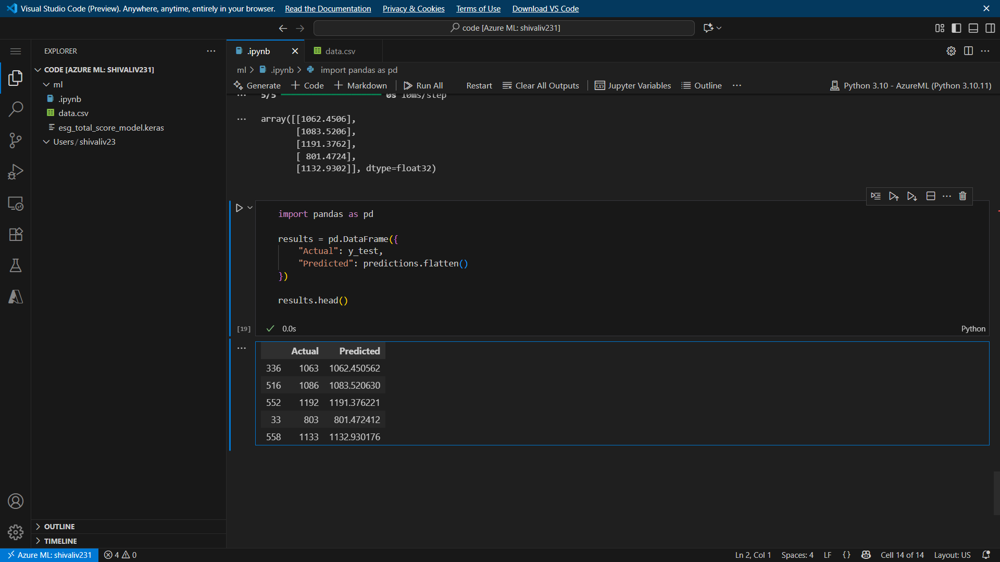
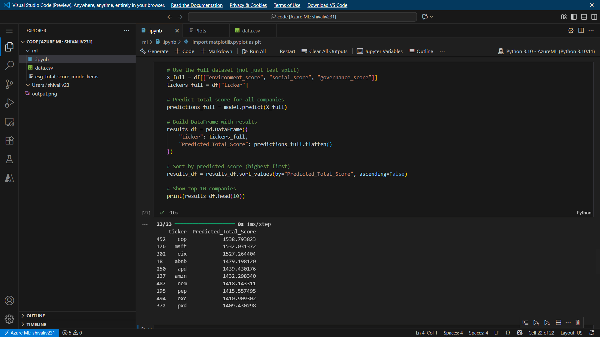
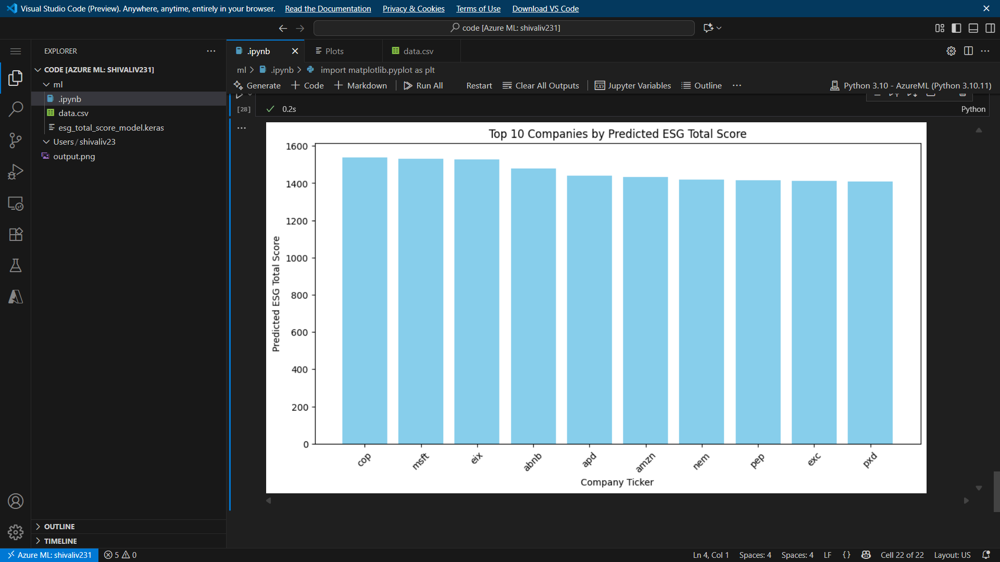

### Global-ESG-Intelligence-Platform

 

---

# 🌍 Global ESG Intelligence Platform  

## Introduction  

The **Global ESG Intelligence Platform** is a **cloud-native data & AI ecosystem** designed to empower enterprises, governments, and financial institutions with **real-time Environmental, Social, and Governance (ESG) intelligence**.  

🌱 **Why ESG?**  
ESG performance is critical for long-term sustainability, investor confidence, and regulatory compliance. Organizations worldwide require **scalable, automated platforms** to:  
- Monitor carbon emissions & renewable energy mix  
- Predict environmental impact and future ESG trends  
- Track compliance with global standards (GRI, SASB, TCFD)  
- Enable **data-driven decision-making** for sustainable growth

⚡ **Key Features & Capabilities**  
- **Cloud-Native & Scalable:** Built on **Azure** using Data Lake, Databricks, and Azure ML for high-volume data processing.  
- **ETL & Data Transformation:** **Azure Data Factory** pipelines ingest raw ESG data from CSV, Excel, APIs, and structure it for analytics.  
- **AI/ML-Driven Insights:** Predictive models with **TensorFlow** identify ESG risks, forecast performance, and recommend actions.  
- **Interactive Dashboards:** **Power BI** visualizes current and predicted ESG metrics for real-time monitoring.  
- **Automated DevOps Pipeline:** **GitHub Actions CI/CD** ensures continuous integration, testing, and deployment.  

🌐 **Future Vision**  
- Integrate **real-time IoT/sensor data** for granular ESG monitoring.  
- Support **scenario-based forecasting** to guide strategic decision-making.  
- Enhance predictive AI models with **reinforcement learning and trend simulations**.

---

## 🏗 Architecture Overview  

mermaid
graph TD
    A[Raw ESG Data Sources] -->|CSV, Excel, APIs| B[Azure Data Lake]
    B --> C[Azure Data Factory ETL Pipelines]
    C --> D[Databricks Data Transformation]
    D --> E[Azure ML TensorFlow Models]
    E --> F[Power BI Dashboards]
    C --> G[GitHub Actions CI/CD Pipeline]

## Arcitecture Diagram

## 🏗️ System Architecture  

flowchart TD
    A[🌠ESG Data Sources (CSV, Excel, APIs)] -->|Ingest| B[Azure Data Lake]
    B -->|ETL & Transformation| C[Azure Data Factory]
    C -->|Clean & Standardized Data| D[Azure Synapse Analytics]
    D -->|Input for Modeling| E[Azure ML with TensorFlow]
    E -->|Predictions & Forecasts| F[Azure Synapse Analytics]
    F -->|KPIs| G[Power BI Dashboards]
    
## 🚀 Features

✅ Data Ingestion: Collects ESG datasets (carbon, water, energy, social & governance metrics) from CSV, Excel, and API sources into Azure Data Lake.
✅ Data Processing: Cleans, validates, and transforms messy ESG data using Azure Data Factory (ADF) pipelines.
✅ Predictive Analytics: Uses Azure ML + TensorFlow to forecast future ESG performance (e.g., carbon reduction trends, renewable adoption rates).
✅ Governance & Compliance: Tracks KPIs aligned with international ESG frameworks.
✅ DevOps Integration: Automated CI/CD pipelines with GitHub Actions, Docker, and Terraform.
✅ Interactive Dashboards: Power BI dashboards for real-time ESG insights and sustainability KPIs.

Real-time dashboards for decision makers

## 📂 Repository Structure
📦 global-esg-intelligence-platform
 ┣ 📂 data             # Sample ESG datasets (CSV, Excel)
 ┣ 📂 notebooks        # ML models (TensorFlow, Python)
 ┣ 📂 pipelines        # ADF pipeline JSONs
 ┣ 📂 infra            # Terraform IaC scripts
 ┣ 📂 docker           # Dockerfiles for ML & ETL
 ┣ 📂 dashboards       # Power BI reports
 ┣ 📂 github-actions   # CI/CD workflows
 ┣ README.md           # Documentation

## 🛠 Tech Stack
Layer	Technology
Cloud	Microsoft Azure
Storage	Azure Data Lake
ETL	Azure Data Factory
Analytics	Azure Synapse
ML/AI	Azure ML + TensorFlow
Visualization	Power BI
DevOps	GitHub Actions, Docker, Terraform
Language	Python
## 📊 Example Dashboards

DataBricks Diagram

## POWERBI VISUALIZATION

## AI Prediction

### AI VISUALIZED PREDICTION 

## 1️⃣ Data Ingestion

Sources: CSV files, Excel sheets, API streams from ESG providers

Stored in Azure Data Lake (Gen2) with hierarchical namespace

Secure and scalable for multi-country ESG datasets

## 2️⃣ ETL Pipelines (Azure Data Factory)

Handle missing values & outliers

Convert units (e.g., metric tons → kilograms)

Standardize time zones, formats, and currency conversions

Store clean, structured data in Azure Synapse

## 3️⃣ Predictive Modeling (Azure ML + TensorFlow)

Train models on historical data

Forecast carbon emissions, water usage, energy demand

Deploy models as containerized APIs with Docker

## 4️⃣ DevOps Automation (CI/CD)

GitHub Actions: Test + deploy pipelines automatically

Docker: Containerization for ML models & ETL scripts

Terraform: Provision infrastructure (Data Lake, Synapse, ML workspace) as code

## 5️⃣ Visualization (Power BI)

ESG KPIs like:

Carbon Reduction %

Renewable Energy Mix

Compliance Scorecards
Renewable Energy Mix

Governance Risk Score

(Insert Power BI screenshots here)

## 🛣️ Roadmap

 Integrate real-time APIs for ESG streaming data

 Deploy ML models on AKS (Azure Kubernetes Service)

 Add anomaly detection for fraudulent ESG reporting

 Expand coverage to multi-cloud (AWS/GCP)

## 🌐 Real-World Impact

This platform can be applied to:

🌱 Corporates: Track & improve sustainability performance

🏦 Banks/Investors: Assess ESG risks before funding

🏛 Governments: Ensure compliance with Paris Agreement targets

📈 Consultancies: Provide ESG insights to clients

## 👥 Contributors  

- **Adharsh U** – Data Engineering, Azure ML, AI Predictions, DevOps Automation  
- **Savio Joseph Francis** – Power BI Dashboards, ESG KPI Visualizations, Reporting

## 📝 License

MIT License © 2025 Global ESG Intelligence Platform Team

---

This is **big, enterprise-grade documentation** — polished like a real GitHub project README ⭐.  

